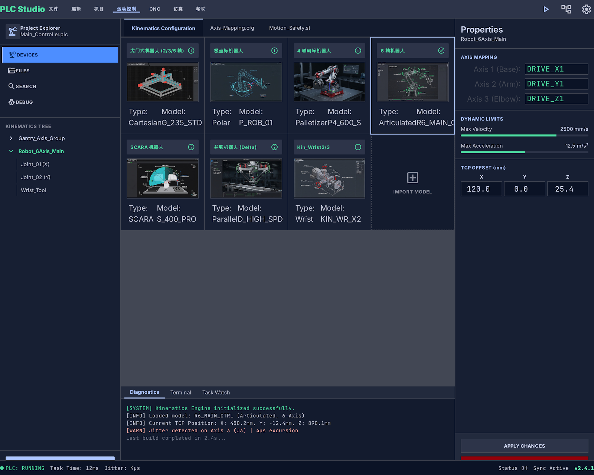
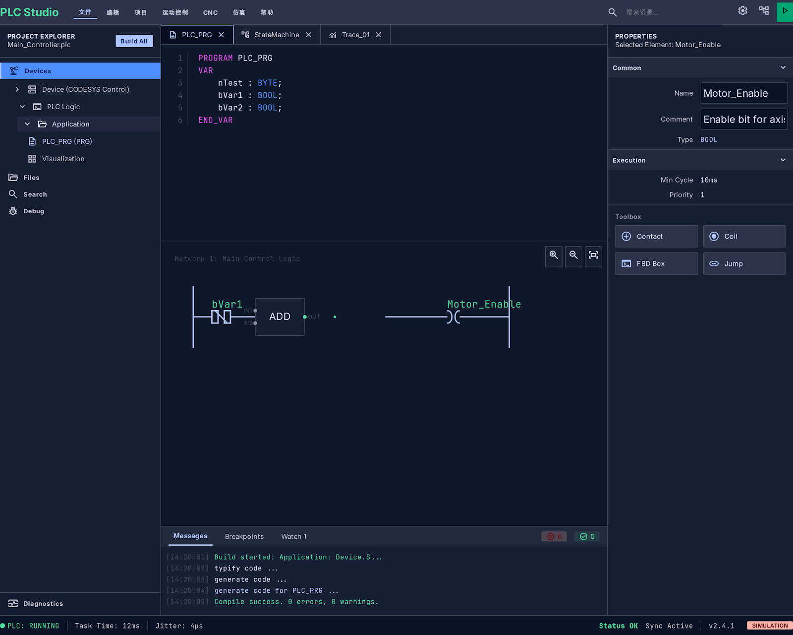
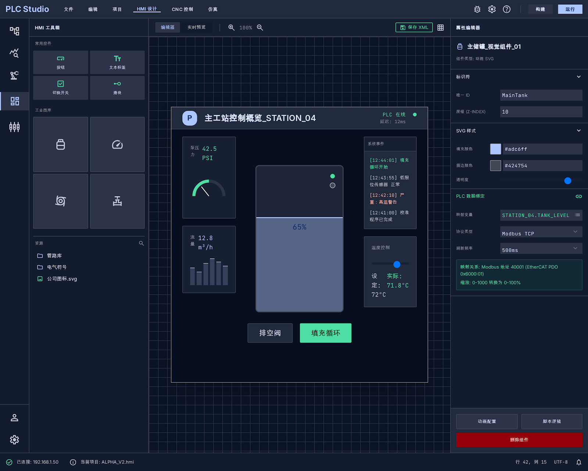
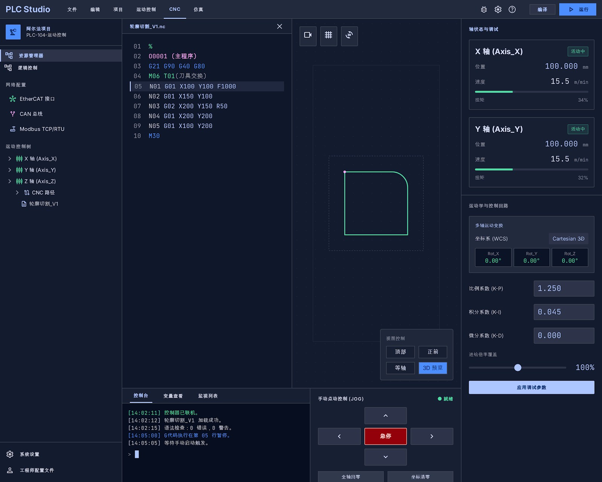
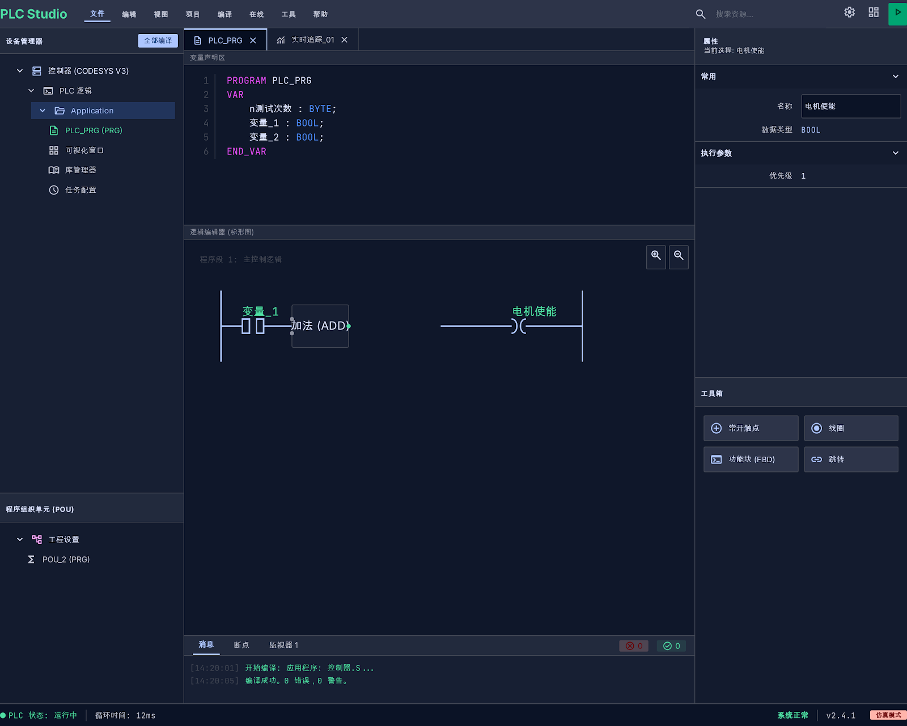
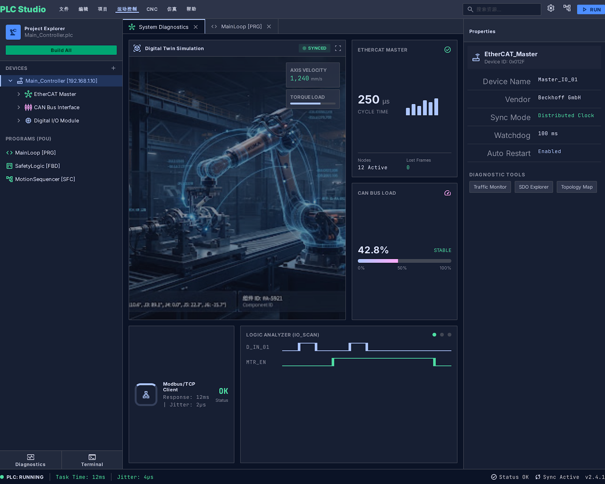
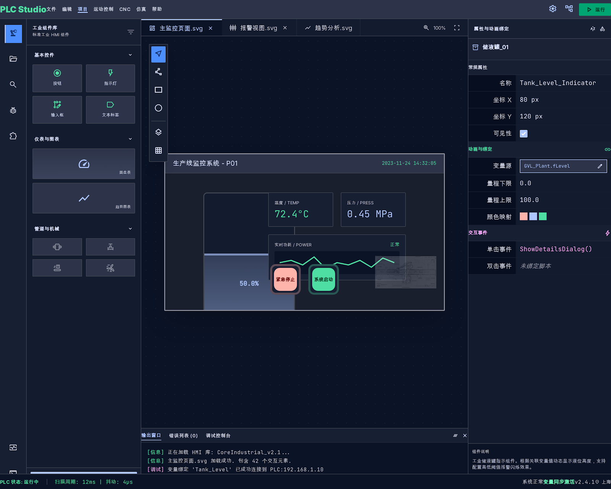

# PLC Studio

一个基于 IEC 61131-3 标准的智能 PLC 集成开发环境，支持多种编程语言、HMI 设计和运动控制仿真。



## 项目简介

PLC Studio 是一个现代化的工业自动化开发平台，旨在为工程师提供一个统一的环境来开发、调试和部署 PLC 程序。项目采用前后端分离架构，前端基于 Vue 3 + TypeScript，后端使用 Fastify，运行时核心使用 C 语言编写，支持多种嵌入式平台。

## 核心功能

### IEC 61131-3 编程语言支持

- **梯形图 (LD)** - 继电器逻辑编程
- **功能块图 (FBD)** - 图形化功能块编程
- **结构化文本 (ST)** - 高级文本编程语言
- **指令表 (IL)** - 汇编风格编程
- **顺序功能图 (SFC)** - 顺序控制编程



### HMI 人机界面设计

- 可视化 HMI 编辑器
- 丰富的控件库
- 实时数据绑定
- 多平台渲染支持 (LVGL、SDL2、Linux FB、Windows)



### CNC 运动控制

- 多轴运动控制 (最多 9 轴)
- G-code 解析与执行
- 实时刀具路径仿真
- 运动学模型支持 (关节型、笛卡尔型、SCARA、并联型)



### 调试与仿真

- 实时变量监控
- 断点调试支持
- 虚拟仿真环境
- 3D 运动可视化

### 串口调试工具

- 串口参数配置（波特率、数据位、停止位、校验位）
- ASCII/HEX 双模式收发
- 串口日志记录与导出
- 波形可视化分析
- 支持 DTR/RTS 信号控制

### 网络调试工具

- **TCP 客户端/服务端** - 连接管理、数据收发、多客户端支持
- **UDP 客户端/服务端** - 数据报收发、绑定管理
- **WebSocket 调试** - 连接测试、消息收发
- **HTTP 测试器** - REST API 调试工具
- **Modbus TCP/RTU** - 工业协议调试



## 项目架构

```
smart-plc-studio/
├── electron/           # Electron 桌面应用
│   ├── serial/         # 串口管理 (IPC)
│   ├── network/        # TCP/UDP/WebSocket 管理
│   └── main.ts         # Electron 主进程
├── packages/
│   ├── editor/         # Vue 3 前端编辑器
│   │   └── src/
│   │       ├── components/tools/  # 调试工具组件
│   │       │   ├── uart/          # 串口调试
│   │       │   ├── network/       # TCP/UDP/WS 调试
│   │       │   ├── modbus/        # Modbus 调试
│   │       │   └── motor/         # 电机调试
│   │       └── serial/            # WebSocket 通信客户端
│   ├── server/         # Fastify 后端服务
│   │   └── src/modules/tools/     # 调试工具后端模块
│   ├── shared/         # 共享类型定义
│   ├── plc-core/       # PLC 核心逻辑
│   └── runtime/        # C 运行时 (支持多平台)
│       ├── core/       # 核心运行时
│       ├── hal/        # 硬件抽象层
│       ├── hmi/        # HMI 渲染引擎
│       ├── protocol/   # 通信协议 (Modbus, EtherCAT, CANopen)
│       └── platform/   # 平台适配 (ESP32, STM32, Linux, Xenomai)
```

## 技术栈

| 层级 | 技术 |
|------|------|
| 前端 | Vue 3, TypeScript, Vite, Pinia, Naive UI |
| 图形 | Fabric.js (2D), Three.js (3D) |
| 代码编辑 | Monaco Editor |
| 后端 | Fastify, @fastify/websocket, Socket.IO, SQLite |
| 桌面 | Electron, IPC |
| 串口 | serialport |
| 运行时 | C11, CMake |
| 通信 | Modbus, EtherCAT, CANopen, TCP/UDP, WebSocket |

## 快速开始

### 环境要求

- Node.js >= 18
- npm >= 9
- CMake >= 3.20 (编译运行时)
- GCC/Clang (Linux) 或 MSVC (Windows)

### 安装与运行

```bash
# 克隆仓库
git clone https://github.com/junke365/plc-studio.git
cd plc-studio/smart-plc-studio

# 安装依赖
npm install

# 启动开发服务器 (前端 + 后端)
npm run dev
```

### 构建

```bash
# 构建所有包
npm run build

# 仅构建前端
npm run build:editor

# 仅构建后端
npm run build:server
```

## 运行时编译

```bash
cd smart-plc-studio/packages/runtime

# Linux
mkdir build && cd build
cmake .. -DCMAKE_BUILD_TYPE=Release
make -j$(nproc)

# 交叉编译 (ESP32)
cmake .. -DCMAKE_TOOLCHAIN_FILE=../platform/esp32/toolchain.cmake
```

## 界面预览

| 主界面 | 梯形图编辑 | FBD 编辑 |
|--------|-----------|----------|
|  |  |  |

| HMI 设计 | 运动仿真 | 调试面板 |
|----------|---------|----------|
|  |  |  |

## 文档

详细文档请参阅 [docs/](docs/) 目录：

- [架构设计](docs/architecture.md)
- [用户指南](docs/user-guide.md)
- [运行时开发](docs/runtime-guide.md)
- [API 参考](docs/api-reference.md)

## 开发计划

- [x] 项目架构搭建
- [x] 编辑器基础框架
- [x] ST 语言语法高亮
- [x] 串口调试工具
- [x] TCP/UDP/WebSocket 网络调试工具
- [x] Modbus TCP/RTU 调试工具
- [x] 电机调试工具（伺服、步进、变频器）
- [ ] 梯形图编辑器
- [ ] FBD 编辑器
- [ ] HMI 设计器
- [ ] PLC 运行时核心
- [ ] CNC 运动控制
- [ ] 调试功能
- [ ] 多平台编译支持

## 贡献

欢迎提交 Issue 和 Pull Request！

## 许可证

MIT License
